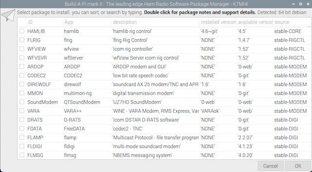

# Codename bAPi mark 2

**PLEASE NOTE BETA**
January 2024 Bookworm note:
- yad errors can be ignored `(yad:12189): Gdk-CRITICAL`
- Conky isnt working well
- VARA [needs installed manually](data/VARA.md)

this is a early release still "beta" RC7
- no .desktop files yet for most things (no menu icons)
- upgrade your OS first. This script is not upgrading the OS.
- VARA and winelink RMS etc, having [global issues](https://github.com/WheezyE/Winelink/issues/72) with ARM-BOX emulation

## Description


bAPi mark II, a fork of the awesome, KM4ACK Build-a-Pi project.

Do you enjoy keeping on the bleeding edge of ham radio software?

Allowing you to get up and running fast with supported hardware for ham radio. Choose the [applications](data/app_db/app-db.md) and build them gentoo style! This keeps your system as lean and mean as possible, and updated to the latest enhancements!

A major fork of this build changes the architecture into a .bapp file for each app. The menu is just a static terminal showing the data in the .bapp app files. All apps in the stable appear to load cross platform.

**What this is:** AUR platform knock off -  because DUR never did? installer for ham development code applications

**What this isn't:** perfect, its bash and yad following developers make instructions all over the internet It wont promise the apps are working or perfect. After-all this is all live development code on linux.

## Platforms Specifically Tested
In theory any Debian platform will work, however the only tested/customized platforms so far. but if you still have python2 as a functioning system or using a distro with python2 .. its getting too old man..

### ARM
- Cortex-A53 raspian 32bit PI3
- Cortex-A72 debian(rasp-os) 32/64bit PI4

### x86_64
- platforms on linuxmint and raspberryDesktopOS
- ubuntu ***testing phase***

### Additional Requirements
The project depends on yad which is a funny word for a GUI manager to give the menu some life in all the bashing about. All listed platforms have access to yad `sudo apt-get install -y yad git` will confirm if this script will function at all. Needless to say you also need a Radio Callsign!

Additionally fast install profiles are new! (but not setup fully yet) Quickly deploy a common group of applications which fast installs the critical components for typical EMCOMM work so you dont need to worry.

## Install
This script tries to keep as small of a footprint as possible, please make sure to have the newest packages installed for your 20.0.0 or greater OS, by running a `sudo apt-get upgrade`.

From a local graphical session terminal window, one line install the following ..
***A one-liner install for copy and paste*** (use the github copy quciklink!)
```
cd $HOME && git clone https://github.com/spudgunman/bapi $HOME/bapi && $HOME/bapi/bapi.sh
```
***if you don't want the preloaded dev-package tools SKIP DEV INSTALLL***
These are the tools needed to build most of the projects here, option given if your dev tools differ. By installing flrig or hamlib you .. also install the same tools and they are basically required to use the other tools so this option is just to skip loading if you want!

### Additional Install Guidance
If long term stability is your goal - recommendations are to NOT update the OS, or the packages in this project after stable functionality is reached. This creates your own distribution which you can replicate or multiply. Helpful for EMCOM work. Build an external hard disk image with this tool to boot a spare or work laptop from!

If you have issues make sure your running the newest code, and OS! `git pull`, and `sudo apt-get update -y && sudo apt-get upgrade -y` if you really get stuck you can start over `mv $HOME/bapi $HOME/bapi.old` and git clone again. Or try a `git reset --hard` followed by a `git pull`. 

To try the beta code, get fancy with `git checkout beta`

Recommended to flash your SD-Card with the official [Raspberry Flash Tool](https://www.raspberrypi.com/software/)
To enable VNC or SSH on PI's [Enable the VNC service](https://www.realvnc.com/en/blog/how-to-setup-vnc-connect-raspberry-pi/)

## Issue Reporting - Feature Requests

groups.io reflector [here](https://groups.io/g/bapi) Please report issues & feature requests [here](https://github.com/spudgunman/bapi/issues) please keep in mind the scope of this project is the core menu (API) and calling the (.bapp) files which are themselves just ported from the developer, and fitted here into a easy to use format. The more details the better check the `errors/` for logs.

Issues with developmental code branches is problematic when operating on early release or development code. Which we are directly getting, the latest and greatest. 

Each bapp file has has a link to the best support information found for direct application support and troubleshooting.

Have an app not working? or want to add an application? check out [contributing](/CONTRIBUTING.md) and more in the [bapp documentation](data/app_db/README.md) and template generator tools.

## Troubleshooting

[groups.io](https://groups.io/g/bapi) you can also try `touch .debug` for more details which may help or make a mess.

`~/.bap-source-files` is where all the source files and build work takes place. This is just a little menu to save you time!

# Recognition

This project wouldn't be anything without Jason Oleham KM4ACK go check him out on [youtube!](https://www.youtube.com/c/KM4ACK) who this project is a direct spawn from. Special thanks to the beta testers KM4ACK and K3OGG, K4OAM

Wine and Box86 work, from [Winelink](https://github.com/WheezyE/Winelink/), Eric Wiessner KI7POL

Autohotspot script work, from [RaspberryConnect.com](https://www.raspberryconnect.com), Graeme Richards ZL2GZ

## TO DO and junk

- autostart conky
- fl suite clean up script/job for all the fl*.gz files in BAPSRC?
- menu and icons
- folders work in yad tree view?
  - publish to readme.md?
- add the backup to know ver and cpu
- add uninstaller / app remover
